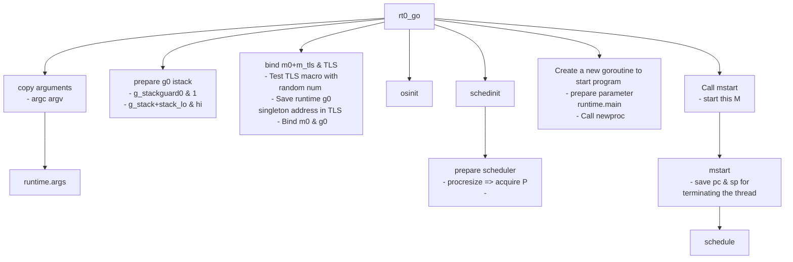
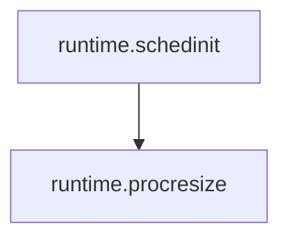
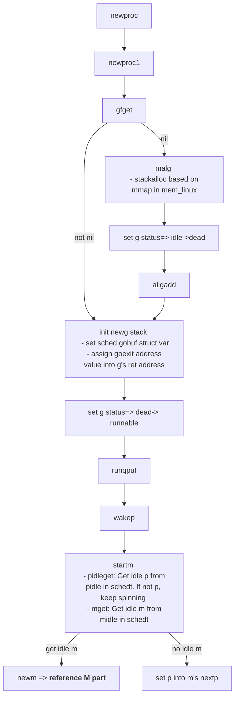
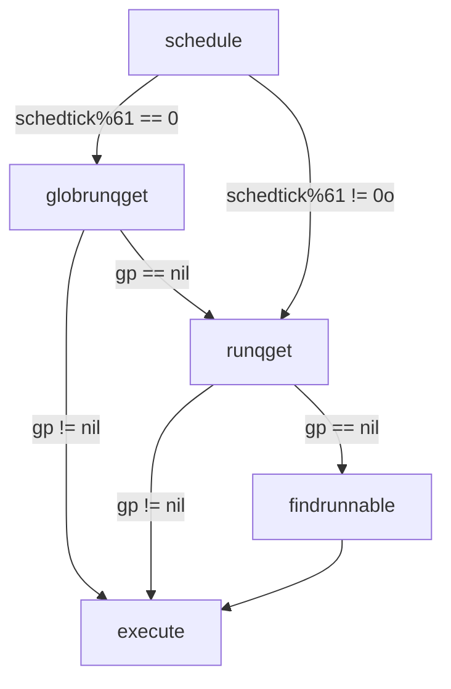
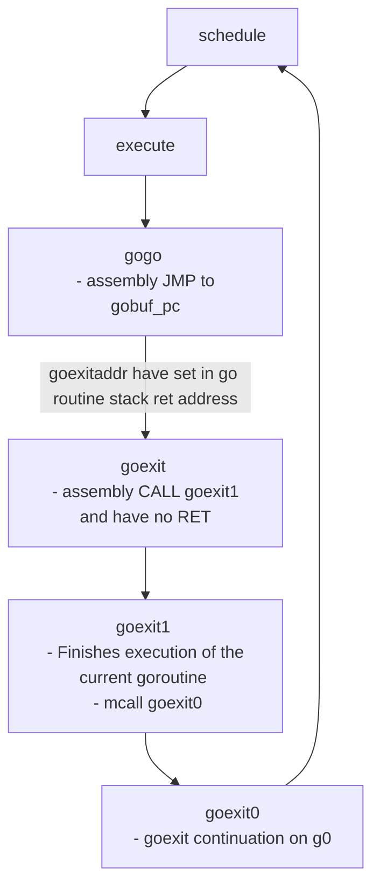
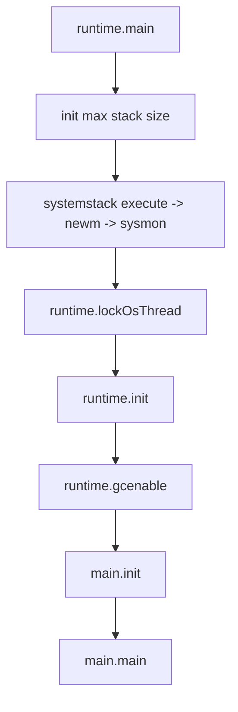
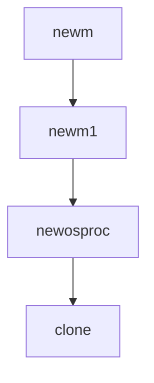

# GO Runtime

## 啟動流程

g0 和 m0是在 proc.go 文件中的两个全局变量，m0就是进程启动后的初始线程，g0也是代表着初始线程的 stack

当要执行 Go runtime 的一些逻辑比如创建g、新建m等，都会首先切换到 g0 栈然后执行，而执行g任务时，会切换到g的栈上。在调度栈和g栈上不断切换



```
// 把 runtime·mainPC 推入 stack 當做 runtime·newproc 的參數  
MOVQ $runtime·mainPC(SB), AX  
PUSHQ AX  
PUSHQ $0  // arg size
// newproc 位于 runtime/proc.go#3240  
// newproc 创建一个新的 g 并放置到等待队列里  
CALL runtime·newproc(SB)  
POPQ AX  
POPQ AX  
  
// mstart 位于 runtime/proc.go#1175  
// mstart 会调用 schedule 函数进入调度状态  
CALL runtime·mstart(SB)  
  
MOVL $0xf1, 0xf1 // crash  
RET
```

## About P
### Definition

P 是 process 的头文字，代表 M 运行 G 所需要的资源.  
一些讲解协程的文章把 P 理解为 cpu 核心，其实这是错误的.  
虽然 P 的数量默认等于 cpu 核心数，但可以通过环境变量  `GOMAXPROC`  修改，在实际运行时 P 跟 cpu 核心并无任何关联.

P 也可以理解为控制 go 代码的并行度的机制，  
如果 P 的数量等于 1, 代表当前最多只能有一个线程 (M) 执行 go 代码，  
如果 P 的数量等于 2, 代表当前最多只能有两个线程 (M) 执行 go 代码.  
执行原生代码的线程数量不受 P 控制.

因为同一时间只有一个线程 (M) 可以拥有 P, P 中的数据都是锁自由 (lock free) 的，读写这些数据的效率会非常的高.

### NewP

程序启动时，会依次调用：



在 procresize 中会将全局 p 数组初始化，并将这些 p 串成链表放进 sched 全局调度器的 pidle 队列中:

```go
for i := nprocs - 1; i >= 0; i-- {
    p := allp[i]

    // ...
    // 设置 p 的状态
    p.status = _Pidle
    // 初始化时，所有 p 的 runq 都是空的，所以一定会走这个 if
    if runqempty(p) {
        // 将 p 放到全局调度器的 pidle 队列中
        pidleput(p)
    } else {
        // ...
    }
}
```

pidleput 也比较简单，没啥可说的:

```go
func pidleput(_p_ *p) {
    if !runqempty(_p_) {
        throw("pidleput: P has non-empty run queue")
    }
    // 简单的链表操作
    _p_.link = sched.pidle
    sched.pidle.set(_p_)

    // pidle count + 1
    atomic.Xadd(&sched.npidle, 1)
}
```

所有 p 在程序启动的时候就已经被初始化完毕了，除非手动调用 runtime.GOMAXPROCS。

```go
func GOMAXPROCS(n int) int {
    lock(&sched.lock)
    ret := int(gomaxprocs)
    unlock(&sched.lock)
    if n <= 0 || n == ret {
        return ret
    }

    stopTheWorld("GOMAXPROCS")

    // newprocs will be processed by startTheWorld
    newprocs = int32(n)

    startTheWorld()
    return ret
}
```


## About G (Goroutine)

### Definition

G 是 goroutine 的头文字，goroutine 可以解释为受管理的轻量线程，goroutine 使用  `go`  关键词创建.

举例来说，`func main() { go other() }`, 这段代码创建了两个 goroutine,  
一个是 main, 另一个是 other, 注意 main 本身也是一个 goroutine.

goroutine 的新建，休眠，恢复，停止都受到 go 运行时的管理.  
goroutine 执行异步操作时会进入休眠状态，待操作完成后再恢复，无需占用系统线程，  
goroutine 新建或恢复时会添加到运行队列，等待 M 取出并运行.

### NewG
在用户代码里一般这么写:

```go
go func() {
    // do the stuff
}()
```

实际上会被翻译成 `runtime.newproc`，特权语法只是个语法糖。如果你要在其它语言里实现类似的东西，只要实现编译器翻译之后的内容就好了。具体流程:



### schedule() & findrunnable()


Goroutine 调度是在_P_中进行，每当 runtime 需要进行调度时，会调用 schedule () 函数， 该函数在 proc.go 文件中定义。

schedule () 函数首先调用 runqget () 从当前_P_的队列中取一个可以执行的_G_。 如果队列为空，继续调用 findrunnable () 函数。findrunnable () 函数会按照以下顺序来取得_G_：

1.  调用 runqget () 从当前_P_的队列中取_G_（和 schedule () 中的调用相同）；
2.  调用 globrunqget () 从全局队列中取可执行的_G_；
3.  调用 netpoll () 取异步调用结束的_G_，该次调用为`非阻塞`调用，直接返回；
4.  调用 runqsteal () 从其他_P_的队列中 “偷”。

如果以上四步都没能获取成功，就继续执行一些低优先级的工作：

1.  如果处于垃圾回收标记阶段，就进行垃圾回收的标记工作；
2.  再次调用 globrunqget () 从全局队列中取可执行的_G_；
3.  再次调用 netpoll () 取异步调用结束的_G_，该次调用为`阻塞`调用。

Schedule function 內部邏輯如下圖



m 中所谓的调度循环实际上就是一直在执行下图中的 loop:



### Release g's resource

干了几件事：

1.  G 的状态变为_GDead，如果是系统 G 则更新全局计数器。
2.  重置 G 身上一系列的属性变量。
3.  解除 M 和 G 的互相引用关系。
4.  放置在本地 P 或全局的 free goroutine 队列。
5.  调度，寻找下一个可运行的 goroutine。

gostartcall function 有將 goexit addr 放至 goroutine 函数 stack sp 的位置。这样做的目的是为了在执行完任何 goroutine 的函数时，通过 RET 指令，都能从栈顶把 sp 保存的 goexit 的指令 pop 到 pc 寄存器，效果相当于任何 goroutine 执行函数执行完之后，都会去执行 runtime.goexit，完成一些清理工作后再进入 schedule。


## About M
### Definition

M 是 machine 的头文字，在当前版本的 golang 中**等同于系统线程**.  
M 可以运行两种代码:

-   go 代码，即 goroutine, M 运行 go 代码需要一个 P
-   原生代码，例如阻塞的 syscall, M 运行原生代码不需要 P

M 会从运行队列中取出 G, 然后运行 G, 如果 G 运行完毕或者进入休眠状态，则从运行队列中取出下一个 G 运行，周而复始.  
有时候 G 需要调用一些无法避免阻塞的原生代码，这时 M 会释放持有的 P 并进入阻塞状态，其他 M 会取得这个 P 并继续运行队列中的 G.  
go 需要保证有足够的 M 可以运行 G, 不让 CPU 闲着，也需要保证 M 的数量不能过多.

#### 主線程 m0

在 runtime 中有三种线程，一种是主线程，一种是用来跑 sysmon 的线程，一种是普通的用户线程。主线程在 runtime 由对应的全局变量:  `runtime.m0`  来表示。用户线程就是普通的线程了，和 p 绑定，执行 g 中的任务。虽然说是有三种，实际上前两种线程整个 runtime 就只有一个实例。用户线程才会有很多实例。

主线程中用来跑  `runtime.main`，流程线性执行，没有跳转:



#### 普通线程

普通线程就是我们 G/P/M 模型里的 M 了，M 对应的就是操作系统的线程。

#### Sysmon
TBD...

### NewM

上面在创建 sysmon 线程的时候也看到了，创建线程的函数是 newm。



#### Practical thread implementation on linux
```
//go:noescape
func clone(flags int32, stk, mp, gp, fn unsafe.Pointer) int32

// May run with m.p==nil, so write barriers are not allowed.
//go:nowritebarrier
func newosproc(mp *m) {
	...
	ret := clone(cloneFlags, stk, unsafe.Pointer(mp), unsafe.Pointer(mp.g0), unsafe.Pointer(funcPC(mstart)))
	...
}

Assembly:
// int32 clone(int32 flags, void *stk, M *mp, G *gp, void (*fn)(void));
TEXT runtime·clone(SB),NOSPLIT,$0
	MOVL	flags+0(FP), DI
	MOVQ	stk+8(FP), SI
	MOVQ	$0, DX
	MOVQ	$0, R10

	// Copy mp, gp, fn off parent stack for use by child.
	// Careful: Linux system call clobbers CX and R11.
	MOVQ	mp+16(FP), R8
	MOVQ	gp+24(FP), R9
	MOVQ	fn+32(FP), R12

	MOVL	$SYS_clone, AX
	SYSCALL
	// => [New LWP 31182]

	// parent & child 同時從此繼續與開始執行
	// 調用 clone 的 parent 邏輯準備 return
	// New thread(child) AX 會是空，符合條件 JEQ 跳三行從 RET 後面繼續執行
	CMPQ	AX, $0
	JEQ	3(PC)
	MOVL	AX, ret+40(FP)
	RET

	// New LWP 從此開始執行
	MOVQ	SI, SP

	// If g or m are nil, skip Go-related setup.
	CMPQ	R8, $0    // m
	JEQ	nog
	CMPQ	R9, $0    // g
	JEQ	nog

	// Initialize m->procid to Linux tid
	MOVL	$SYS_gettid, AX
	SYSCALL
	MOVQ	AX, m_procid(R8)

	// Set FS to point at m->tls.
	// 把 (TLS) 指向 m->tls，runtime·settls 裡面有 SYSCALL ARCH_SET_FS
	LEAQ	m_tls(R8), DI
	CALL	runtime·settls(SB)

	// In child, set up new stack
	get_tls(CX)
	MOVQ	R8, g_m(R9)
	MOVQ	R9, g(CX)
	CALL	runtime·stackcheck(SB)

nog:
	// Call fn
	CALL	R12

	// It shouldn't return. If it does, exit that thread.
	MOVL	$111, DI
	MOVL	$SYS_exit, AX
	SYSCALL
	JMP	-3(PC)	// keep exiting
```

#### TLS

TLS 的全称是  [Thread-local storage](https://en.wikipedia.org/wiki/Thread-local_storage), 代表每个线程的中的本地数据.

例如标准 c 中的 errno 就是一个典型的 TLS 变量，每个线程都有一个独自的 errno, 写入它不会干扰到其他线程中的值.

go 在实现协程时非常依赖 TLS 机制，会用于获取系统线程中当前的 G 和 G 所属的 M 的实例.

因为 go 并不使用 glibc, 操作 TLS 会使用系统原生的接口，以 linux x64 为例，

go 在新建 M 时会调用  [SYSCALL ARCH_SET_FS](http://man7.org/linux/man-pages/man2/arch_prctl.2.html)  这个 syscall 设置 FS 寄存器的值为 M.tls 的地址，

运行中每个 M 的 FS 寄存器都会指向它们对应的 M 实例的 tls, linux 内核调度线程时 FS 寄存器会跟着线程一起切换，

---
```
package main

import (
    "fmt"
    "time"
)

func printNumber(from, to int, c chan int) {
    for x := from; x <= to; x++ {
        fmt.Printf("%d\n", x)
        time.Sleep(1 * time.Millisecond)
    }
    c <- 0
}

func main() {
    c := make(chan int, 3)
    go printNumber(1, 3, c)
    go printNumber(4, 6, c)
    _ = <- c
    _ = <- c
}

```
-   程序启动时会先创建一个 g0 & m0, 指向的是 main, 实际是 runtime.main 而不是 main.main
-   图中的虚线指的是 G 待运行或者开始运行的地址，不是当前运行的地址.


- M 会取得这个 G 并运行:

- 这时 main 会创建一个新的 channel, 并启动两个新的 G:

- 接下来 `G: main` 会从 channel 获取数据，因为获取不到，G 会**保存状态**并变为等待中 (_Gwaiting) 并添加到 channel 的队列:

- 因为 `G: main` 保存了运行状态，下次运行时将会从`_ = <- c` 继续运行.  
接下来 M 会从运行队列获取到 `G: printNumber` 并运行:

- printNumber 会打印数字，完成后向 channel 写数据，  
写数据时发现 channel 中有正在等待的 G, 会把数据交给这个 G, 把 G 变为待运行 (_Grunnable) 并重新放入运行队列:

- 接下来 M 会运行下一个 `G: printNumber`, 因为创建 channel 时指定了大小为 3 的缓冲区，可以直接把数据写入缓冲区而无需等待:

- 然后 printNumber 运行完毕，运行队列中就只剩下 `G: main` 了:

- 最后 M 把 `G: main` 取出来运行，会从上次中断的位置`_ <- c` 继续运行:

