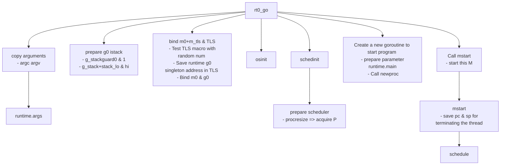
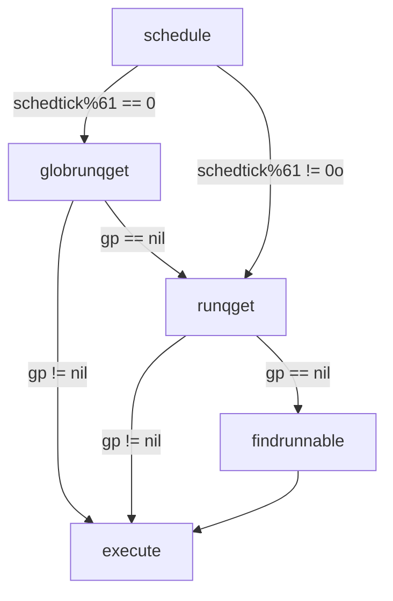
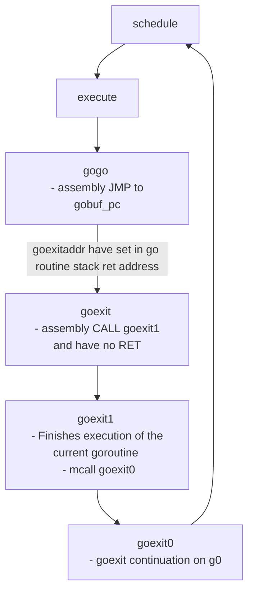

## GO Runtime

### 啟動流程
g0和m0是在 proc.go 文件中的两个全局变量，m0就是进程启动后的初始线程，g0也是代表着初始线程的stack

当要执行Go runtime的一些逻辑比如创建g、新建m等，都会首先切换到g0栈然后执行，而执行g任务时，会切换到g的栈上。在调度栈和g栈上不断切换





## 4.1 schedule()与findrunnable()函数

Goroutine调度是在_P_中进行，每当runtime需要进行调度时，会调用schedule()函数， 该函数在proc1.go文件中定义。

schedule()函数首先调用runqget()从当前_P_的队列中取一个可以执行的_G_。 如果队列为空，继续调用findrunnable()函数。findrunnable()函数会按照以下顺序来取得_G_：

1.  调用runqget()从当前_P_的队列中取_G_（和schedule()中的调用相同）；
2.  调用globrunqget()从全局队列中取可执行的_G_；
3.  调用netpoll()取异步调用结束的_G_，该次调用为非阻塞调用，直接返回；
4.  调用runqsteal()从其他_P_的队列中“偷”。

如果以上四步都没能获取成功，就继续执行一些低优先级的工作：

1.  如果处于垃圾回收标记阶段，就进行垃圾回收的标记工作；
2.  再次调用globrunqget()从全局队列中取可执行的_G_；
3.  再次调用netpoll()取异步调用结束的_G_，该次调用为阻塞调用。

如果还没有获得_G_，就停止当前_M_的执行，返回findrunnable()函数开头重新执行。 如果findrunnable()正常返回一个_G_，shedule()函数会调用execute()函数执行该_G_。 execute()函数会调用gogo()函数（在汇编源文件asm_XXX.s中定义，XXX代表系统架构），gogo() 函数会从_G_.sched结构中恢复出_G_上次被调度器暂停时的寄存器现场（SP、PC等），然后继续执行。


檢查是否處於GC態 檢查本地有沒有可執行的G 檢查全域性佇列有沒有可執行的G 檢查網路I/O有沒有可以恢復執行的G 去別的佇列裡偷 還是沒有，就把自己掛起 原文網址：https://itw01.com/QPKQSEJ.html

Go的runtime中，M是 Machine ，代表作業系統的執行緒 P是 Processor ，意思是邏輯處理器，在最初的版本里是沒有P的 G是 Goroutine 。是Go中執行任務的單元，也是coroutine中的最小個體。 原文網址：https://itw01.com/QPKQSEJ.html

m 中所谓的调度循环实际上就是一直在执行下图中的 loop:



gostartcall function 有將 goexit addr 放至 goroutine 函数 stack sp 的位置。这样做的目的是为了在执行完任何 goroutine 的函数时，通过 RET 指令，都能从栈顶把 sp 保存的 goexit 的指令 pop 到 pc 寄存器，效果相当于任何 goroutine 执行函数执行完之后，都会去执行 runtime.goexit，完成一些清理工作后再进入 schedule。
```
package main

import (
    "fmt"
    "time"
)

func printNumber(from, to int, c chan int) {
    for x := from; x <= to; x++ {
        fmt.Printf("%d\n", x)
        time.Sleep(1 * time.Millisecond)
    }
    c <- 0
}

func main() {
    c := make(chan int, 3)
    go printNumber(1, 3, c)
    go printNumber(4, 6, c)
    _ = <- c
    _ = <- c
}
```
- 程序启动时会先创建一个 g0 & m0, 指向的是main,实际是 runtime.main 而不是main.main
- 图中的虚线指的是G待运行或者开始运行的地址, 不是当前运行的地址.


- M会取得这个G并运行:

- 这时main会创建一个新的channel, 并启动两个新的G:

- 接下来`G: main`会从channel获取数据, 因为获取不到, G会**保存状态**并变为等待中(_Gwaiting)并添加到channel的队列:

- 因为`G: main`保存了运行状态, 下次运行时将会从`_ = <- c`继续运行.  
接下来M会从运行队列获取到`G: printNumber`并运行:

- printNumber会打印数字, 完成后向channel写数据,  
写数据时发现channel中有正在等待的G, 会把数据交给这个G, 把G变为待运行(_Grunnable)并重新放入运行队列:

- 接下来M会运行下一个`G: printNumber`, 因为创建channel时指定了大小为3的缓冲区, 可以直接把数据写入缓冲区而无需等待:

- 然后printNumber运行完毕, 运行队列中就只剩下`G: main`了:

- 最后M把`G: main`取出来运行, 会从上次中断的位置`_ <- c`继续运行:

